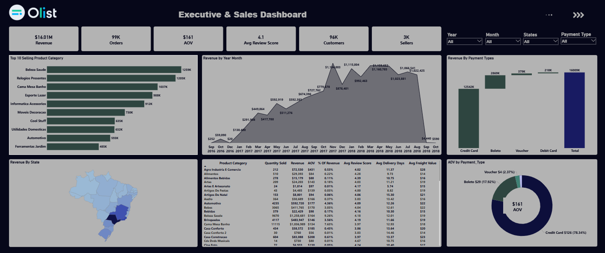
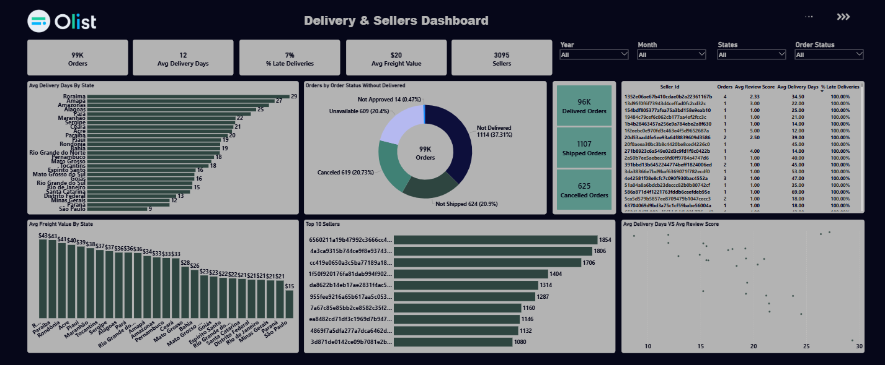
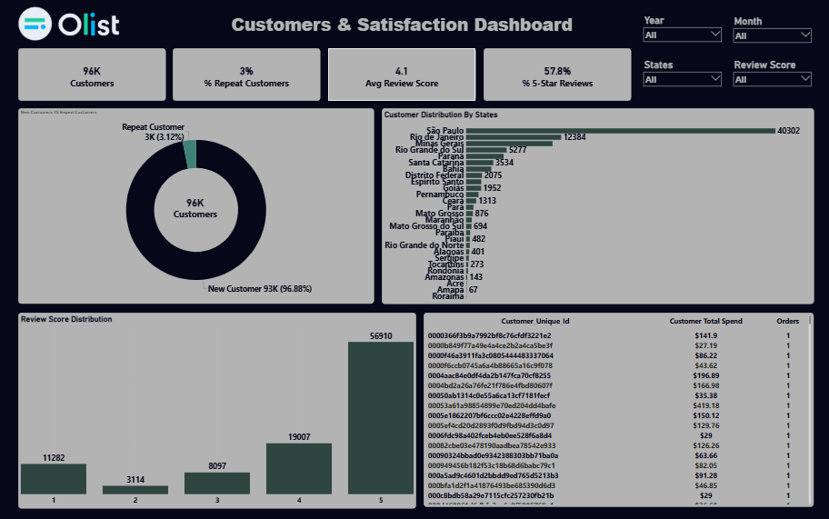

# Olist E-Commerce Analytics Dashboard | Power BI

An end-to-end Power BI analytics project built on the **Brazilian E-Commerce Public Dataset by Olist**, covering sales performance, delivery & logistics, and customer satisfaction across ~99,000 orders placed between September 2016 and October 2018.

---

## Dashboard Preview

The project consists of **3 interconnected report pages**, each answering a different business question:


| **Executive & Sales** | Revenue, products, payments | *How is the business performing overall?* |
| **Delivery & Sellers** | Logistics, fulfillment, seller performance | *Are we delivering on time, and who's responsible?* |
| **Customers & Satisfaction** | Customer behavior, loyalty, reviews | *Who are our customers, and are they happy?* |

---

## 1. Executive & Sales Dashboard


**Purpose:** High-level view of business health — revenue, order volume, top products, and payment behavior.

**KPIs:** Revenue · Orders · AOV · Avg Review Score · Customers · Sellers

**Visuals:**
- Top 10 Selling Product Categories (Bar)
- Revenue by Year-Month (Line, chronologically sorted)
- Revenue by State (Filled Map)
- Revenue by Payment Type (Bar) + AOV by Payment Type (Donut)
- Detailed Product Category table (Quantity Sold, Revenue, AOV, % of Revenue, Avg Review Score, Avg Delivery Days, Avg Freight Value)

**Slicers:** Year, Month, States, Payment Type

---

## 2. Delivery & Sellers Dashboard


**Purpose:** Evaluate logistics performance and identify where delays or fulfillment issues originate.

**KPIs:** Orders · Avg Delivery Days · % Late Deliveries · Avg Freight Value · Sellers

**Visuals:**
- Avg Delivery Days by State (Bar)
- Avg Freight Value by State (Bar)
- Order Fulfillment Status breakdown, excluding "Delivered" for readability (Donut)
- Delivered / Shipped / Cancelled Orders (Cards)
- Top 10 Sellers by order volume (Bar)
- Avg Delivery Days vs Avg Review Score (Scatter) — tests whether slower delivery correlates with lower satisfaction

**Slicers:** Year, Month, States, Order Status

---

## 3. Customers & Satisfaction Dashboard


**Purpose:** Understand who the customers are, how loyal they are, and how satisfied they are with their experience.

**KPIs:** Customers · % Repeat Customers · Avg Review Score · % 5-Star Reviews

**Visuals:**
- New vs Repeat Customers (Donut)
- Customer Distribution by State (Bar)
- Review Score Distribution, 1–5 stars (Bar)
- Top Customers by Total Spend (Table)

**Slicers:** Year, Month, States, Review Score

---

## Data Source

[Brazilian E-Commerce Public Dataset by Olist](https://www.kaggle.com/datasets/olistbr/brazilian-ecommerce) — 9 relational CSV tables covering orders, order items, payments, reviews, products, customers, sellers, and geolocation.

**Note on date range:** 2016 data starts in September, and 2018 data ends in October — both are partial years. Any year-over-year comparison should account for this.

---

## Data Model

Star schema built around `orders` and `order_items` as the core fact tables, connected to:

- `customers` (deduplicated `customer_unique_id` used for all customer-level counts, since `customer_id` is order-level and repeats per purchase)
- `products` → `product_category_name_translation`
- `sellers`
- `order_payments`
- `order_reviews`
- `geolocation` — aggregated via Group By (average lat/lng per zip code prefix) to make `zip_code_prefix` unique before relating it to `customers`, avoiding a many-to-many relationship
- `Date Table` — a dedicated calendar table built from `orders[Order Date]` (a date-only column derived from the original timestamp), marked as the official date table and used for all time intelligence (e.g. Revenue LM, YTD)

**Key modeling fixes applied:**
- Removed data type mismatches between `Date/Time` timestamp columns and the `Date`-only calendar table that were silently breaking relationships and returning blank aggregates
- Standardized "Total Revenue" as `price + freight_value` to reflect the full amount actually paid by the customer
- Category-level revenue calculated from `order_items[price]` rather than `order_payments[payment_value]`, since a single payment can span multiple items/categories per order

---

## Data Quality Notes

Documented rather than silently cleaned, in line with data integrity practices:

- **Missing `product_category_name`** (~610 products): replaced with `"Uncategorized"` in Power Query. Related numeric fields (photos, weight, dimensions) were left blank rather than imputed, since DAX aggregations correctly ignore blanks.
- **Inconsistent order status vs. dates**: a small number of orders marked `order_status = "delivered"` had missing approval/shipping/delivery timestamps, and a small number marked `"canceled"` had a populated delivery date — flagged via an `Order Fulfillment Status` calculated column rather than corrected, to preserve the original data while making the inconsistency visible and excludable from time-based averages.
- **Blank delivery/approval dates** across the dataset were evaluated against `order_status` to confirm they reflect real order lifecycle stages (e.g. `processing`, `shipped`, `canceled`) rather than data errors.

---

## Key DAX Measures

```dax
Total Revenue = SUM(order_items[price]) + SUM(order_items[freight_value])

AOV = DIVIDE([Total Revenue], DISTINCTCOUNT(order_items[order_id]))

Total Customers = DISTINCTCOUNT(customers[customer_unique_id])

% Repeat Customers = 
DIVIDE(
    CALCULATE(
        DISTINCTCOUNT(customers[customer_unique_id]),
        FILTER(
            VALUES(customers[customer_unique_id]),
            CALCULATE(DISTINCTCOUNT(orders[order_id])) > 1
        )
    ),
    [Total Customers]
)

% Late Deliveries = 
DIVIDE(
    CALCULATE(
        COUNTROWS(orders),
        NOT(ISBLANK(orders[order_delivered_customer_date])),
        orders[order_delivered_customer_date] > orders[order_estimated_delivery_date]
    ),
    CALCULATE(
        COUNTROWS(orders),
        NOT(ISBLANK(orders[order_delivered_customer_date]))
    )
)
```

---

## Tools Used

- **Power BI Desktop** — data modeling, DAX, visualization
- **Power Query** — data cleaning and transformation
- **DAX** — Total Revenue, AOV, Repeat Customers, Late Deliveries, time intelligence measures

---